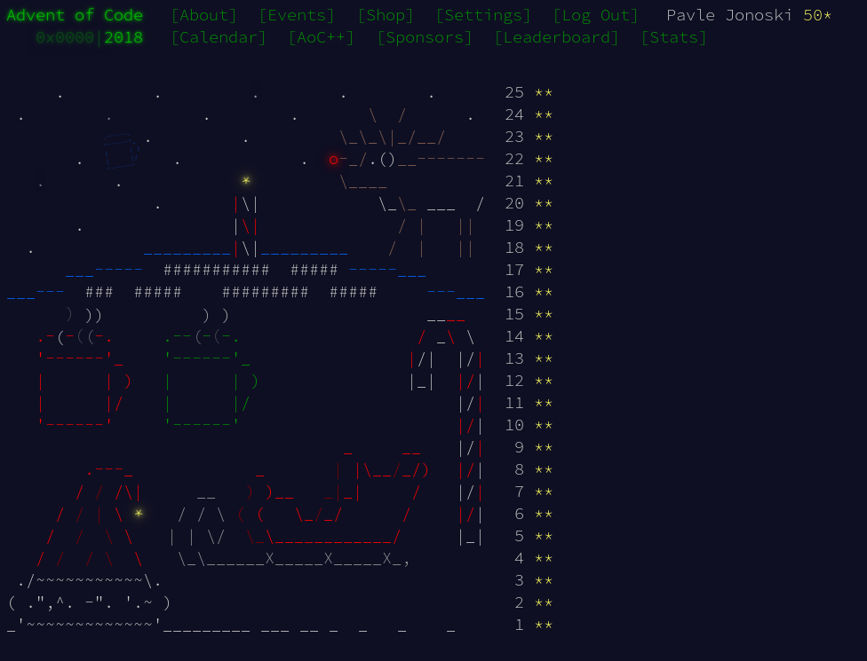

# :santa: adventofcode2018 :christmas_tree:
:christmas_tree: Advent Of Code (https://adventofcode.com) solutions. :christmas_tree:

:sparkler: :confetti_ball:  Solved in 25 different languages:christmas_tree: :christmas_tree:

| Day 1 | Day 2 | Day 3 | Day 4 | Day 5 |
|-------|-------|-------|-------|-------|
| [NASM](http://www.nasm.us/)  | [Scheme]()  | [Standard ML](http://www.mlton.org/) | [Haskell](https://www.haskell.org/)  | [Clojure](https://clojure.org) 

| Day 6 | Day 7 | Day 8 | Day 9 | Day 10 |
|-------|-------|-------|-------|--------|
| [Rust](https://www.rust-lang.org/) | [Octave](https://www.gnu.org/software/octave/)  | [SQL](https://www.postgresql.org/docs/current/plpgsql.html)  | [Elixir](https://elixir-lang.org/)  | [Scala](https://www.scala-lang.org/)  |

| Day 11 | Day 12 | Day 13 | Day 14 | Day 15 |
|--------|--------|--------|--------|--------|
| [Bash](https://www.gnu.org/software/bash/)  | [Julia](https://julialang.org/)  | [Awk](https://www.gnu.org/software/gawk/) | [Nim](https://nim-lang.org/)  | [Kotlin](https://kotlinlang.org/)  |

| Day 16 | Day 17 | Day 18 | Day 19 | Day 20 |
|--------|--------|--------|--------|--------|
| [Lua](https://www.lua.org/)  | [PHP](https://secure.php.net/)  | [C#](https://docs.microsoft.com/en-us/dotnet/csharp/language-reference/)  | [R](https://www.r-project.org/)  | [C](https://en.wikipedia.org/wiki/C_(programming_language))  |

| Day 21 | Day 22 | Day 23 | Day 24 | Day 25 |
|--------|--------|--------|--------|--------|
| [TypeScript](https://www.typescriptlang.org/)  | [JavaScript](https://developer.mozilla.org/en-US/docs/Web/JavaScript) | [Java](http://oracle.com/java/)  | [Golang](https://golang.org/)  | [Python](https://www.python.org/)   |
